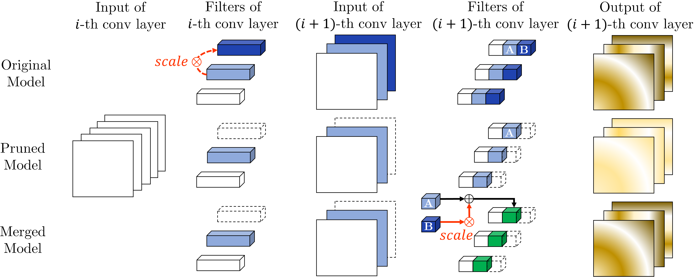

# Neuron Merging: Compensating for Pruned Neurons

This repository is the official implementation of  **Neuron Merging: Compensating for Pruned Neurons**, accepted at 34th Conference on Neural Information Processing Systems (NeurIPS 2020).    





## Requirements

To install requirements:

```setup
conda env create -f ./environment.yml
```

Python environment & main libraries:

* python 3.8
* pytorch 1.5.0
* scikit-learn 0.22.1
* torchvision 0.6.0


## LeNet-300-100

To test LeNet-300-100 model on FashionMNIST, run:

```eval
bash scripts/LeNet_300_100_FashionMNIST.sh -t [model type] -c [criterion] -r [pruning ratio]
```

You can use three arguments for this script:

- model type: original | prune | merge
- pruning criterion : l1-norm | l2-norm | l2-GM
- pruning ratio : 0.0 ~ 1.0


For example, to test the model after pruning 50% of the neurons with $l_1$-norm criterion, run: 

```
bash scripts/LeNet_300_100_FashionMNIST.sh -t prune -c l1-norm -r 0.5
```

To test the model after merging , run: 

```
bash scripts/LeNet_300_100_FashionMNIST.sh -t merge -c l1-norm -r 0.5
```


## VGG-16

To test VGG-16 model on CIFAR-10, run:

```eval
bash scripts/VGG16_CIFAR10.sh -t [model type] -c [criterion]
```

You can use two arguments for this script

- model type: original | prune | merge
- pruning criterion: l1-norm | l2-norm | l2-GM


As a pretrained model on CIFAR-100 is not included, you must train it first. To train VGG-16 on CIFAR-100, run:

```eval
bash scripts/VGG16_CIFAR100_train.sh
```

All the hyperparameters are as described in the supplementary material.


After training, to test VGG-16 model on CIFAR-100, run:

```eval
bash scripts/VGG16_CIFAR100.sh -t [model type] -c [criterion]
```

You can use two arguments for this script

- model type: original | prune | merge
- pruning criterion: l1-norm | l2-norm | l2-GM


## ResNet

To test ResNet-56 model on CIFAR-10, run:

```eval
bash scripts/ResNet56_CIFAR10.sh -t [model type] -c [criterion] -r [pruning ratio]
```

You can use three arguments for this script

- model type: original | prune | merge
- pruning method : l1-norm | l2-norm | l2-GM
- pruning ratio : 0.0 ~ 1.0


To test WideResNet-40-4 model on CIFAR-10, run:

```eval
bash scripts/WideResNet_40_4_CIFAR10.sh -t [model type] -c [criterion] -r [pruning ratio]
```

You can use three arguments for this script

- model type: original | prune | merge
- pruning method : l1-norm | l2-norm | l2-GM
- pruning ratio : 0.0 ~ 1.0


## Results

Our model achieves the following performance on (without fine-tuning) :

### Image classification of LeNet-300-100 on FashionMNIST

**Baseline Accuracy : 89.80%**

| Pruning Ratio | Prune ($l_1$-norm) | Merge      |
| ------------- | ------------------ | ---------- |
| 50%           | 88.40%             | **88.69%** |
| 60%           | 85.17%             | **86.92%** |
| 70%           | 71.26%             | **82.75%** |
| 80%           | 66.76              | **80.02%** |


### Image classification of VGG-16 on CIFAR-10

**Baseline Accuracy : 93.70%**

| Criterion  | Prune  | Merge      |
| ---------- | ------ | ---------- |
| $l_1$-norm | 88.70% | **93.16%** |
| $l_2$-norm | 89.14% | **93.16%** |
| $l_2$-GM   | 87.85% | **93.10%** |


## Citation

```
@inproceedings{kim2020merging,
  title     = {Neuron Merging: Compensating for Pruned Neurons},
  author    = {Kim, Woojeong and Kim, Suhyun and Park, Mincheol and Jeon, Geonseok},
  booktitle = {Advances in Neural Information Processing Systems},
  year      = {2020}
}
```